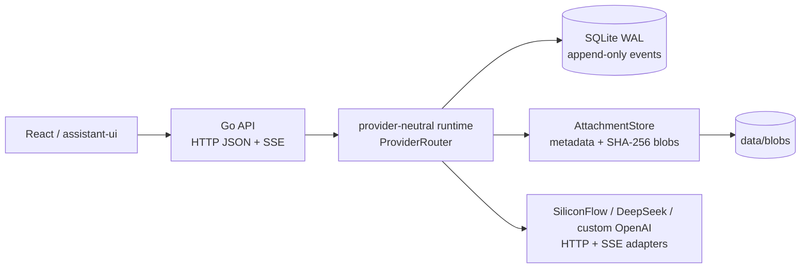

# DeepStudent-Go

DeepStudent-Go is an incremental Go runtime migration for DeepStudent. It
combines a local-first Go HTTP/SSE service with a small React/MyGo desktop
shell, so the runtime boundary can evolve without replacing the existing
product all at once.

> **Status: prototype / migration workspace**
>
> The Go transport, deterministic stream, SQLite event store, and desktop shell
> are working foundations. The web chat still uses a local `StubAdapter`; it is
> not yet wired to the Go SSE endpoint. An iOS client is planned as an
> experiment and has not been built in this repository.

## What exists today

| Area | Current state |
| --- | --- |
| Go runtime | HTTP JSON + SSE routes, SiliconFlow/DeepSeek-compatible provider adapters, request IDs, structured errors, exact-origin CORS |
| Persistence | CGO-free SQLite with WAL, single-writer policy, append-only session events, and attachment metadata |
| Attachments | SHA-256 content-addressed blobs under `data/blobs`; SQLite stores metadata and `workspace://` references |
| Desktop shell | MyGo window with a React 19 + TypeScript + Vite UI and typed health bridge |
| Web preview | Responsive DeepStudent shell with chat, learning resources, tasks, flashcards, settings, and light/dark themes |
| CI | Go format/test/vet/build checks, Pages preview workflow, unsigned macOS arm64 workflow |
| Not implemented | Authentication, durable SSE replay/cancel, production tool sandbox, and a native iOS app |

The existing DeepStudent implementation remains the source of truth until the
migration passes compatibility and benchmark gates.

## Verification status

The checkout includes [`go-backend.yml`](.github/workflows/go-backend.yml),
which runs `gofmt`, `go test ./...`, `go vet ./...`, and a CGO-free server
build on pushes to `feature/go-backend-runtime` and pull requests targeting
`main` or that backend branch. The goal branch is not a push trigger in this
workflow; use `workflow_dispatch` on this branch or add an explicit trigger
before relying on CI for it. This checkout has no recorded successful Actions
run, so treat Go CI as **unverified until a run is observed in GitHub Actions**.
Do not describe the backend as CI-green based on this README alone.

For a local verification pass, run:

```sh
gofmt -w cmd internal
test -z "$(gofmt -l cmd internal)"
go test ./...
go vet ./...
CGO_ENABLED=0 go build ./cmd/server
```

The frontend can be checked independently with `bun run typecheck` and
`bun run build` from `frontend/`. These checks do not prove that the browser
chat is wired to the Go SSE API.

Use this matrix to keep local claims honest. A check marked **not verified**
needs a fresh run in an environment with the required toolchain; this checkout
does not include an Actions result to cite.

| Surface | Command or evidence | Current status |
| --- | --- | --- |
| Go formatting | `gofmt -w cmd internal && test -z "$(gofmt -l cmd internal)"` | Unverified in this checkout |
| Go unit tests | `go test ./...` | Unverified in this checkout |
| Go static checks | `go vet ./...` | Unverified in this checkout |
| CGO-free server build | `CGO_ENABLED=0 go build ./cmd/server` | Unverified in this checkout |
| Frontend type/build | `cd frontend && bun run typecheck && bun run build` | Independent; unverified here |
| HTTP smoke | `GET /healthz`, `GET /readyz`, `POST /api/v1/runs` | Manual smoke required |
| SSE smoke | `GET /api/v1/runs/:id/events` and inspect terminal event | Manual; in-memory stream only |
| Attachment storage | `go test ./internal/attachments ./internal/storage` | Tests present; unverified here |
| Docker profile | `docker compose up --build`; repeat health/SSE smoke | Manual; local profile only |

The Go server is loaded once at process startup. `config.Manager` provides
validated atomic reloads for embedding callers, but this command does not
watch files or expose a reload endpoint.

## Architecture



The MyGo window hosts the same React shell and currently exposes a typed health
bridge. The browser chat still uses a local stub; wiring it to the Go SSE API is
the next integration step.

The contracts live in [`protocol/runtime-v1.md`](protocol/runtime-v1.md) and
the backend boundary is documented in
[`docs/backend-architecture.md`](docs/backend-architecture.md). The current
SSE route streams live in-memory run events; persisted events are the basis for
a future replay API, not a claim that reconnect/resume already works. A late
subscriber can receive the run history while it remains in memory (currently
about five minutes after completion); there is no durable replay or
`Last-Event-ID` contract yet.

## Technology

- Go 1.27.1, `net/http`, provider-neutral runtime interfaces, and OpenAI-compatible HTTP/SSE adapters
- SQLite via `modernc.org/sqlite` (CGO-free, WAL, single writer)
- React 19, TypeScript, Vite, and `@assistant-ui/react`
- MyGo 0.1.22 for the desktop shell and generated-compatible bindings
- Bun for frontend install/build scripts
- Docker Compose for a local server profile

## Run locally

Prerequisites: Go 1.27+, Bun, and (optionally) Docker.

### Go API + SSE runtime

```sh
go test ./...
go vet ./...
go run ./cmd/server
```

The default listener is `127.0.0.1:8080`; SQLite is stored at
`data/deepstudent.db`. The default profile remains deterministic for offline
development; real SiliconFlow and DeepSeek adapters read credentials only from
environment variables when that provider is explicitly selected. The `DEEPSTUDENT_CONFIG` JSON path is optional;
environment values override file values. Useful overrides are:

```sh
DEEPSTUDENT_HTTP_ADDR=127.0.0.1:8080 \
DEEPSTUDENT_DB_PATH=data/deepstudent.db \
DEEPSTUDENT_CORS_ALLOWLIST=http://localhost:5173 \
go run ./cmd/server
```

Model routes are independent from transport. A provider may declare
`baseURL`/`base_url`, an `apiKeyEnv` reference, and defaults; its `models` map
can override `reasoning_effort`, `max_tokens`, and `input` capabilities for a
model. `DEEPSTUDENT_BASE_URL` and
`DEEPSTUDENT_PROVIDER_<NAME>_BASE_URL` provide deployment overrides without
loading API keys into config. `config.Manager` reloads validated snapshots
atomically and leaves the last known-good config on invalid edits.

`cmd/server` registers the deterministic, SiliconFlow, DeepSeek, and custom
OpenAI-compatible profiles. Select a provider explicitly with
`DEEPSTUDENT_DEFAULT_PROVIDER` or the run request. Keep API-key values out of
JSON, Dockerfiles, compose files, logs, and run requests; configure only the
environment-variable name (`apiKeyEnv`) and inject the value at process startup.

### Configuration reference

Configuration is loaded in this order: built-in defaults, the optional JSON
file named by `DEEPSTUDENT_CONFIG`, then environment overrides. Invalid reloads
leave the last known-good snapshot in place. Common local overrides are:

| Variable | Default | Purpose |
| --- | --- | --- |
| `DEEPSTUDENT_HTTP_ADDR` | `127.0.0.1:8080` | bind address for the API |
| `server.readTimeout` (JSON only) | `15s` | maximum request-header/read time |
| `server.writeTimeout` (JSON only) | `30s` | maximum response lifetime, including SSE |
| `server.idleTimeout` (JSON only) | `60s` | keep-alive idle timeout |
| `DEEPSTUDENT_DB_PATH` | `data/deepstudent.db` | SQLite metadata/event database path |
| `DEEPSTUDENT_BLOB_ROOT` | `data/blobs` | content-addressed attachment blob root |
| `DEEPSTUDENT_ATTACHMENT_MAX_BYTES` | `33554432` | maximum accepted attachment bytes; `0` disables the limit |
| `DEEPSTUDENT_ATTACHMENT_ALLOWED_MIME` | common text/document/image/audio/video types | comma-separated MIME allowlist; supports `type/*` |
| `DEEPSTUDENT_CORS_ALLOWLIST` | localhost/127.0.0.1:5173 | comma-separated exact origins |
| `DEEPSTUDENT_DEFAULT_PROVIDER` | `deterministic` | provider route for new runs (`siliconflow`, `deepseek`, or `custom-openai` are available) |
| `DEEPSTUDENT_DEFAULT_TIMEOUT` | `45s` | runtime run timeout |
| `DEEPSTUDENT_MAX_TOKENS` | `2048` | runtime token ceiling |
| `DEEPSTUDENT_MAX_CONCURRENCY` | `2` | bounded active runs |
| `DEEPSTUDENT_AUTH_ENABLED` | `false` | reserved session boundary; login is not implemented |

Provider endpoint and credential settings use metadata only. Set
`DEEPSTUDENT_PROVIDER_<NAME>_BASE_URL` or a `baseURL`/`baseURLEnv` reference;
set `apiKeyEnv` to the name of an environment variable, never to the secret
value. Provider adapters are instantiated by `cmd/server`, but no credential is
required until a remote provider is selected.

### HTTP and SSE contract

The local profile exposes only the following routes:

- `GET /healthz` for process liveness
- `GET /readyz` for runtime readiness
- `GET /api/v1/` for the API version
- `POST /api/v1/runs` with `{ "prompt", "session_id"?, "provider"?, "model"?, "max_tokens"? }`
- `GET /api/v1/runs/:id/events` as `text/event-stream`

The run request returns `202 Accepted`, a `run_id`, and an `events_url`.
Responses carry `X-Request-ID`; JSON failures use an `error` envelope with a
machine-readable code, message, and request ID. SSE event IDs are stable only
for the in-memory retention window. Current event types are `run.started`,
`message.delta`, `run.completed`, and `run.error`. The server does not expose
session history, run status, cancellation, attachment upload/download, or
durable cross-process replay routes in this slice.

Try the current stream:

```sh
curl -s http://127.0.0.1:8080/healthz
curl -s -X POST http://127.0.0.1:8080/api/v1/runs \
  -H 'content-type: application/json' \
  -d '{"prompt":"hello"}'
# Paste the returned run_id between the quotes:
RUN_ID="paste-run-id"
curl -N "http://127.0.0.1:8080/api/v1/runs/${RUN_ID}/events"
```

Runtime runs are bounded by the configured default timeout (45s by default);
completed in-memory history is retained briefly (about five minutes) to allow
an immediate late subscription, then released. Persisted session events are
written synchronously when a session ID is supplied, but no HTTP replay route
reads them yet.

### Web shell

```sh
bun install
bun run dev:web
```

This serves the responsive shell through Vite. Its chat adapter is still a
local stub, while the settings view can report the MyGo health bridge when
running inside the desktop shell.

### MyGo desktop shell

```sh
bun install
go install github.com/egoist/mygo/cmd/mygo@v0.1.22
mygo generate
bun run build -- -platform darwin/arm64
```

The build is unsigned and currently configured for macOS 12+ arm64. Linux
configuration is present; release packaging and signing are not part of this
prototype.

### Attachments

Attachments are accepted by the storage layer as immutable, content-addressed
blobs. `internal/attachments` streams each upload to a temporary file while
computing SHA-256, enforces the configured byte and MIME policy, and atomically
places the blob at `data/blobs/<first-two-hex>/<sha256>`. SQLite stores only
metadata (`sha256`, byte size, MIME, filename, creation time) and the canonical
`workspace://attachments/<sha256>` reference. Re-uploading the same bytes is
idempotent and reuses the existing blob.

The current slice deliberately keeps the attachment API behind the storage
boundary; callers must resolve references through `storage.AttachmentStore` so
untracked files cannot be opened. Future HTTP upload/download routes should
preserve this boundary and apply authentication, quotas, and request limits
before exposing it remotely.

The SQLite schema migration creates an `attachments` metadata table and indexes
creation time. Bytes never enter SQLite. A duplicate upload reuses the same
digest/reference, while an interrupted upload can leave an unreferenced blob;
garbage collection is intentionally deferred. Back up the database and blob
root together because either one alone is insufficient to resolve a reference.

### Docker profile

```sh
docker compose up --build
# stop the server; keep the named volume for SQLite/blob persistence
docker compose down
```

The process listens on `0.0.0.0:8080` inside the container; Compose publishes
it only on host `127.0.0.1:8080` and stores SQLite metadata/events plus
content-addressed attachment blobs under `/data` in the `deepstudent-data`
volume. Provider credentials are intentionally not included. The image
pre-creates `/data` with the distroless non-root UID's ownership so a new named
volume can be opened by the server. Verify this permission when switching
volume drivers or a pre-existing host bind mount. Back up SQLite and `/data/blobs`
together: a `workspace://attachments/<sha256>` reference is useful only while
both its metadata row and blob are retained.

### Development loop

Run the Go server first, then start the Vite shell in a second terminal:

```sh
# terminal 1
go run ./cmd/server

# terminal 2
bun install
bun run dev:web
```

The default deterministic provider makes this loop offline and reproducible;
remote provider runs use bounded retries, request timeouts, and redacted errors.
Use `curl` against `/healthz` and `/api/v1/runs` before debugging the shell;
the shell's current chat stub does not exercise the Go stream. Keep SQLite and
`data/blobs` out of commits (both are ignored by `.gitignore`) and never put
provider credentials in source or frontend code.

## Preview links

These are explicit placeholders until a deployment/artifact URL is recorded:

- Expected Pages URL after a successful deployment (verify before sharing): https://ba7mlv.github.io/DeepStudent-Go/
- macOS preview artifact: `<MACOS_ARTIFACT_URL>` (the workflow artifact URL is run-specific)
- CI workflow (real link): [`macOS shell workflow`](https://github.com/BA7MLV/DeepStudent-Go/actions/workflows/macos-shell.yml)
- Pages workflow (real link): [`Pages preview workflow`](https://github.com/BA7MLV/DeepStudent-Go/actions/workflows/pages-preview.yml)

Do not treat a workflow run as a published app. The macOS job currently emits
an unsigned arm64 artifact when it succeeds.

## Screenshots / visual review

There are no product screenshots in this checkout yet (only app/logo assets).
Add real captures under `docs/screenshots/` after running the corresponding
surface; do not substitute generated or imagined screenshots.

| Surface | Reproducible capture checklist | Suggested file |
| --- | --- | --- |
| Web shell | Run `bun run dev:web`; capture 1440×900 light and dark chat states, then one learning-resource state | `docs/screenshots/web-shell-light.png`, `web-shell-dark.png`, `web-learning-hub.png` |
| macOS shell | Build with the MyGo command above; open the unsigned `.app`; capture the chat landing and settings/health state | `docs/screenshots/macos-shell.png` |
| Go stream | Run `cmd/server`; capture `/healthz` and an SSE run in a terminal or API client | `docs/screenshots/api-sse.png` |
| iOS experiment | Capture only after a native target exists and its shell reaches the stated experiment gates | `docs/screenshots/ios-shell.png` |

## iOS shell experiment (planned, not built)

The iOS work is a thin-client experiment around the existing Go contracts. It
is inspired by Telegram's native iOS information architecture and interaction
density—compact list rows, fast search, a chat-first detail view, swipe/context
actions, and a bottom composer—without claiming a Telegram clone or a finished
iOS product.

### Proposed information architecture

1. **Sessions** — the launch surface: pinned/recent study sessions, compact
   64–72pt rows, unread/run status, pull-to-refresh, and search
2. **Session detail** — dense message timeline, streaming assistant deltas,
   inline run status, and a bottom composer with attachment/tool affordances
3. **Study** — resources, tasks, and flashcards as secondary shelves
4. **Settings** — runtime URL, diagnostics, theme, and experiment flags

Use `NavigationStack` on iPhone and `NavigationSplitView` on iPad. Keep the
first spike intentionally small: fake session data and shell interactions first,
then replace the data source with the Go API without redesigning navigation.

### Go API / SSE seam

The native client should target a configurable base URL and use this sequence:

1. `GET /healthz` and `GET /readyz` before enabling send
2. `POST /api/v1/runs` with `{ "session_id", "prompt", "model", "max_tokens" }`
3. Read the returned `events_url` as `text/event-stream`
4. Map `run.started`, `message.delta`, `run.completed`, and `run.error` into
   timeline state; keep `id` and `run_id` for diagnostics

The current server does not expose an authenticated iOS profile, durable SSE
replay endpoint, cancellation route, or remote-device discovery. A native
client must therefore treat the experiment as local/test-only, avoid embedding
provider secrets, and show a recoverable “connection lost” state instead of
pretending that a run resumed. Add replay/cancel/auth contracts before any
shared or production deployment.

### Suggested experiment gates

- **Spike:** navigation, dense session rows, empty/loading/error states, and
  fake streaming timeline
- **API slice:** health check, prompt submission, and live SSE deltas against
  the deterministic Go provider
- **Resilience slice:** explicit reconnect/error UI and event diagnostics; only
  enable resume after a server-side replay contract exists
- **Decision gate:** compare scroll/typing latency and information density with
  the web shell before deciding whether to continue a native client

The proposed Swift/Xcode target (for example `ios/DeepStudentShell/`) does not
exist yet. This section is a design plan, not evidence that an iOS app has been
built.

## Repository map

```text
cmd/server/                 local Go HTTP/SSE server
cmd/deepstudent/            MyGo desktop entry point
internal/api/               HTTP, CORS, errors, and SSE transport
internal/runtime/           provider-neutral contracts and deterministic stub
internal/attachments/       MIME/size policy and content-addressed blob store
internal/storage/           SQLite schema and append-only event store
internal/auth/              future server-side session boundary (disabled)
frontend/                   React shell and MyGo-compatible health client
protocol/runtime-v1.md      versioned request/event envelope
docs/backend-architecture.md
```

## Branch relationship

- `goal/data-attachment-foundation` is the attachment slice documented here. It
  adds the SQLite metadata table, content-addressed blob store, MIME/size
  policy, and Docker persistence boundary on top of the backend runtime base.
- `feature/go-backend-runtime` is the backend migration base. It adds the local
  HTTP/SSE service, SQLite event store, deterministic provider, Docker profile,
  and backend-specific CI workflow.
- `migration/mygo-shell-poc` is the UI-first shell experiment. Its chat remains
  a local stub and it has no Go backend verification workflow.
- The existing DeepStudent implementation remains the source of truth until
  compatibility, performance, and security gates are agreed and met. Keep the
  runtime contract versioned when integrating the two branches.

## Known limitations and roadmap

The current server is local/test-only: authentication is disabled, only the
deterministic provider is instantiated, and the browser shell is not connected
to `/api/v1/runs`. SSE history is in-memory and retained briefly for late
subscriptions; durable replay, reconnect/resume, HTTP cancellation, and remote
client discovery are not implemented. Tool execution, telemetry, real provider
adapters, blob garbage collection, signed packaging, and production deployment
are also out of scope.

Next gates are:

1. Connect the shell through a typed HTTP/SSE adapter and add contract tests.
2. Add explicit replay/cancel/auth semantics before shared or remote use.
3. Integrate a real provider through an environment-backed secret boundary.
4. Benchmark persistence/runtime behavior and document migration/recovery.
5. Add accessibility, release-signing, deployment, and incident/runbook gates.

## Safety and scope

This workspace is local-first and intentionally conservative: deterministic
offline behavior is the default, credentials are referenced by environment
name rather than persisted values, and the first milestone does not migrate the
full product, delete the existing implementation, or change its data schemas.
