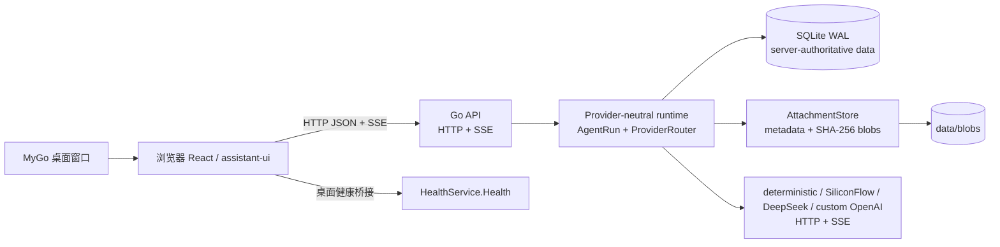

# DeepStudent-Go

DeepStudent-Go 是 DeepStudent 的渐进式 Go 运行时迁移工作区。它把本地优先的 Go HTTP/SSE 服务、SQLite 持久化、附件存储，以及一个 React + MyGo 桌面壳放在同一个仓库中，让运行时边界可以逐步替换，而不用一次性重写现有产品。

> **状态：原型 / 迁移实验（prototype / migration workspace）**
>
> Go 传输层、确定性事件流、SQLite 事件存储、附件基础设施和桌面壳已经具备可运行的基础。Web/MyGo 已接入 Go HTTP/SSE，支持文本聊天、附件上传和学习资源导入；认证、RAG/生产级工具沙箱、远程部署和原生 iOS 客户端仍未完成。现有 DeepStudent 实现仍是兼容性和性能对照的事实来源。

## 先看结论

- **后端是持久化的唯一权威。** 会话、消息、运行记录和会话事件由 Go 服务写入 SQLite；前端应通过 HTTP 读取，而不是把浏览器状态当作数据源。
- **前端和后端已接通聊天。** React 壳通过类型化 runtime adapter 调用 `/api/v1/sessions/:id/messages` 或 `/api/v1/runs`，再订阅 SSE；Go 服务负责会话、消息、附件和运行状态的权威持久化。
- **实时输出走 SSE。** `POST /api/v1/runs` 返回 `202` 和 `events_url`，客户端随后订阅 `GET /api/v1/runs/:id/events`。
- **SSE 支持短期和持久重放。** 运行期间以及结束后的约 5 分钟会保留事件历史，可用 `Last-Event-ID` 补发；进程内存释放后，带 SQLite 的服务会从 `session_events` 恢复该 run 的事件。客户端仍应通过会话/消息接口读取完整历史。
- **默认配置不访问网络。** `deterministic` provider 用于离线开发和可重复测试。SiliconFlow、DeepSeek 与自定义 OpenAI-compatible provider 只有在显式选择后才会读取环境变量中的凭据。
- **部署范围是本机或本地 Docker。** 认证默认关闭，远程设备发现、生产工具执行、签名发布和 iOS 客户端均属于后续实验。

## 现状一览

| 区域 | 当前状态 |
| --- | --- |
| Go runtime | HTTP JSON + SSE；provider-neutral runtime；请求 ID；结构化错误；精确 Origin CORS |
| 权威持久化 | CGO-free SQLite、WAL、单写入者；会话/消息/运行/追加式事件；运行结束状态同步写入 |
| 附件 | `data/blobs` 下的 SHA-256 内容寻址文件；SQLite 只保存元数据和 `workspace://` 引用 |
| Web 预览 | React 19 + TypeScript + Vite；HTTP/SSE 文本聊天、附件上传、学习资源导入、待办、闪卡、设置及明暗主题 |
| MyGo 桌面壳 | 与 Web 共用 React UI；桌面进程同时托管 Go HTTP/SSE 服务和 `HealthService.Health` 类型化桥接 |
| CI | Go 格式化/测试/vet/build 检查；Pages 预览；未签名 macOS arm64 工作流 |
| 尚未完成 | 认证、RAG/生产工具沙箱、远程部署、原生 iOS 客户端 |

## 架构与数据流



一次运行的权威流程如下：

1. 客户端向 `POST /api/v1/runs`（或 `POST /api/v1/sessions/:id/messages`）提交 prompt。API 校验模型选择、token 上限和会话信息；有持久化存储且未指定 `session_id` 时会创建会话。
2. API 先在服务端保存用户消息（若请求带会话），再启动 runtime；runtime 创建 `runs` 记录。
3. runtime 产生 `run.started`、`message.delta` 和终止事件。每个事件先追加到 `session_events`，再广播给 SSE 订阅者；文本增量同时写入 `messages`。运行状态最终更新为 `completed`、`failed` 或 `canceled`。
4. API 立即返回 `202 Accepted`、`run_id`、`session_id` 和 `events_url`。客户端再打开 SSE 连接并按事件顺序渲染。
5. 前端刷新或重新打开会话时，应调用会话/消息查询接口；SSE 订阅可用 `Last-Event-ID` 恢复内存或 SQLite 中该 run 的后续事件。

因此，浏览器 UI 是展示层，Go 服务是会话、消息、附件和运行数据的权威源。静态预览在 runtime 不可用时仍可使用本地 fallback，但成功创建 Go run 后不会再启动第二个本地回复。

## SQLite 数据布局与持久化边界

`internal/storage` 打开 SQLite 时启用 `PRAGMA journal_mode = WAL` 和外键约束，并把最大连接数设为 1，避免低资源本地安装产生写锁风暴。每次追加事件使用短事务计算会话序号并插入，读取可以在同一连接池中并发进行。

迁移按版本执行（当前 schema version 为 3）：

| 表 | 用途 |
| --- | --- |
| `schema_migrations` | 已应用迁移版本 |
| `sessions` | 会话 ID、标题、创建/更新时间 |
| `runs` | run ID、所属会话、provider/model、状态、完成时间 |
| `session_events` | 按 `(session_id, sequence)` 排序的追加式事件和 JSON payload |
| `messages` | 会话时间线中的 user/assistant 消息 |
| `provider_profiles` | provider 元数据（不保存 API key 值） |
| `settings` | 预留的键值设置 |
| `jobs` | 预留的任务状态和 payload |
| `attachments` | SHA-256、大小、MIME、文件名、时间和唯一 workspace 引用 |

附件字节不会进入 SQLite。`internal/attachments` 在临时文件中流式计算 SHA-256，通过大小/MIME 策略后原子移动到：

```text
data/blobs/<sha256 前两位>/<完整 sha256>
```

SQLite 只保存 `workspace://attachments/<sha256>`。相同内容重复上传是幂等的；中断上传可能留下未引用 blob，垃圾回收尚未实现。备份时必须同时保存 SQLite 文件和 `data/blobs`，缺一不可解析引用。附件 HTTP API 通过严格的 SHA-256/workspace 引用校验暴露上传、元数据查询和内容流。

持久化是服务器权威，但本版本对极端故障的语义仍有限：事件写入错误在 runtime 的事件广播路径中不会变成客户端错误；批量写入、独立读池、blob GC 和崩溃恢复需要基准测试与回放语义后再启用。

## SSE 事件、连接与重放

SSE 响应使用 `text/event-stream`，每条消息包含：

```text
id: evt-...
event: message.delta
data: {"id":"evt-...","run_id":"run-...","type":"message.delta",...}
```

目前定义的事件类型包括：

- `run.started`
- `message.delta`
- `tool.call`（协议保留，当前默认 provider 不产生）
- `run.completed`
- `run.error`
- `run.canceled`

客户端可在重连时发送 `Last-Event-ID`。确定性 runtime 会先从内存历史补发其后的事件；内存清理后会读取 SQLite 的 `session_events`（若服务使用持久存储）。每个已结束 run 的内存历史最多保留约 5 分钟，随后 run 和事件频道从进程内存释放；因此：

- 持久 replay 以已知 `run_id` 和 `Last-Event-ID` 为边界，不是任意历史事件搜索接口；
- 不带 SQLite 的内存 store 只提供进程内 replay；
- 客户端不能把“成功重连”误认为“服务端已经恢复了任意旧 run”；
- 生产部署前仍需补充鉴权、配额、cancel 和断线 UI 契约。

## HTTP API（v1）

所有响应带 `X-Request-ID`；JSON 错误使用 `error.code`、`error.message`、`error.request_id`，CORS 只允许精确 Origin，不支持通配符。

- `GET /healthz`：进程存活检查
- `GET /readyz`：runtime 就绪检查
- `GET /api/v1/`：API 版本
- `GET /api/v1/sessions?limit=50&offset=0`：列出会话
- `POST /api/v1/sessions`：创建或更新会话（`id`、`title`）
- `GET /api/v1/sessions/:id`：读取会话
- `GET /api/v1/sessions/:id/messages`：读取消息时间线
- `POST /api/v1/sessions/:id/messages`：追加用户 prompt 并启动 run
- `POST /api/v1/runs`：启动 run，返回 `202`、run 元数据和 `events_url`
- `GET /api/v1/runs/:id`：读取运行状态（当前优先读取内存；内存 run 被清理后，HTTP 查询仍可能返回 404）
- `POST /api/v1/runs/:id/cancel`：请求取消
- `GET /api/v1/runs/:id/events`：订阅 SSE
- `POST /api/v1/attachments`：以 `multipart/form-data` 上传附件（文件字段名推荐 `file`，也接受 `attachment`/`upload`），返回 SHA-256、大小、MIME、文件名和 `workspace://attachments/<sha256>` 引用
- `GET /api/v1/attachments/:id`：按 SHA-256 ID（或 `workspace://` 引用）读取附件内容流；添加 `?metadata=1` 或 `Accept: application/json` 查询元数据
- `GET /api/v1/attachments?ref=workspace://attachments/<sha256>`：查询附件元数据；`/metadata/<id>`、`/content/<id>`、`/download/<id>` 是等价的自描述别名

本版本没有会话删除、工具调用、登录、跨进程事件恢复或远程客户端发现接口。

`POST /api/v1/runs` 和会话消息接口接受 `client_message_id`（也兼容
`message_id`）。同一个会话中重试相同 ID 和内容会返回原来的 `run_id`，
不同内容会得到 `409 message_id_conflict`；客户端遇到未知的 POST 结果时应
重试原请求，而不是启动本地第二个回复。SSE 在运行期间每 15 秒发送一条
注释 heartbeat，并且每个取消、失败或成功的 run 都发送一个终止事件。

附件 API 只接受由服务端生成的 `workspace://attachments/<sha256>`（兼容解析早期的 `workspace://<sha256>`）；不会把请求中的路径直接拼接到文件系统。Blob 在写入前通过大小上限和 MIME allowlist 校验，下载响应带 `ETag` 和 `Accept-Ranges`，元数据与 blob 分开存储在 SQLite 和内容寻址目录中。

快速验证当前 SSE 流：

```sh
# terminal 1
go run ./cmd/server

# terminal 2
curl -s http://127.0.0.1:8080/healthz
curl -s -X POST http://127.0.0.1:8080/api/v1/runs \
  -H 'content-type: application/json' \
  -d '{"prompt":"hello"}'

# 将上一步返回的 run_id 填入
RUN_ID="paste-run-id"
curl -N "http://127.0.0.1:8080/api/v1/runs/${RUN_ID}/events"
```

运行受默认超时（默认 45 秒）和最大并发数（默认 2）约束。`cmd/server` 当前把默认 HTTP `readTimeout` 设为 15 秒、`writeTimeout` 设为 0（不限制 SSE 响应生命周期）、`idleTimeout` 设为 60 秒；如在 JSON 配置中设置写超时，应确认它不会提前截断长流。

## 配置、provider 与密钥

加载顺序是：内置默认值 → `DEEPSTUDENT_CONFIG` 指定的可选 JSON → 环境变量覆盖。`config.Manager.Reload` 会校验完整快照后原子替换；无效配置保留上一个有效快照，不会探测 provider 可用性或凭据。

Provider profile 只保存 endpoint、模型、能力、重试和**环境变量名**。API key 的值只在进程启动/请求时从环境读取，绝不能写入 JSON、Dockerfile、Compose、日志、事件或浏览器请求。可使用 `DEEPSTUDENT_BASE_URL`、`DEEPSTUDENT_PROVIDER_<NAME>_BASE_URL` 等覆盖部署地址。

常用配置：

| 变量 | 默认值 | 作用 |
| --- | --- | --- |
| `DEEPSTUDENT_HTTP_ADDR` | `127.0.0.1:8080` | API 监听地址 |
| `DEEPSTUDENT_HEALTHCHECK_URL` | `http://127.0.0.1:8080/readyz` | Docker 镜像健康检查 URL；桌面/本地运行通常无需设置 |
| `DEEPSTUDENT_DB_PATH` | `data/deepstudent.db` | SQLite 路径 |
| `DEEPSTUDENT_BLOB_ROOT` | `data/blobs` | 内容寻址 blob 根目录 |
| `DEEPSTUDENT_ATTACHMENT_MAX_BYTES` | `33554432` | 单个附件最大字节数；`0` 取消上限 |
| `DEEPSTUDENT_ATTACHMENT_ALLOWED_MIME` | 常见文本/文档/图片/音视频 | 逗号分隔的 MIME allowlist，支持 `type/*` |
| `DEEPSTUDENT_CORS_ALLOWLIST` | localhost/127.0.0.1:5173 | 逗号分隔的精确 Origin |
| `DEEPSTUDENT_DEFAULT_PROVIDER` | `deterministic` | 新 run 的默认 provider |
| `DEEPSTUDENT_DEFAULT_TIMEOUT` | `45s` | 单次 runtime 超时 |
| `DEEPSTUDENT_MAX_TOKENS` | `2048` | runtime token 上限 |
| `DEEPSTUDENT_MAX_CONCURRENCY` | `2` | 同时运行上限 |
| `DEEPSTUDENT_SIDECAR_MODE` | `deterministic` | `external` 转发到外部 Pi；`managed/local` 使用显式 `DEEPSTUDENT_PI_COMMAND` 启动本地 sidecar |
| `DEEPSTUDENT_SIDECAR_URL` | 空 | 外部 sidecar 的绝对 HTTP(S) 地址（例如 `http://127.0.0.1:8787`）；仅 external 模式使用 |
| `DEEPSTUDENT_PI_CANCEL_TIMEOUT` | `2s`（sidecar 默认） | 外部 sidecar 取消请求的超时 |
| `DEEPSTUDENT_PI_COMMAND` | 空 | managed/local 模式的可执行文件（不经过 shell） |
| `DEEPSTUDENT_PI_ARGS` | 空 | managed/local 模式参数，逗号分隔 |
| `DEEPSTUDENT_AUTH_ENABLED` | `false` | 预留的会话边界；登录尚未实现 |

JSON 中的 `server.readTimeout`、`server.writeTimeout`、`server.idleTimeout` 和 provider/model 细节没有对应的全部环境变量；需要更细配置时使用 `DEEPSTUDENT_CONFIG`。默认 provider 是 `deterministic`，可显式选择 `siliconflow`、`deepseek` 或 `custom-openai`。若选择远程 provider，先配置相应 endpoint 和 API key 环境变量。

## 本地运行

前置条件：Go 1.27+、Bun；Docker 可选。

### Go API + SSE runtime

```sh
go test ./...
go vet ./...
go run ./cmd/server
```

默认监听 `127.0.0.1:8080`，数据写入 `data/deepstudent.db` 和 `data/blobs`。开发时建议保留确定性 provider，以获得离线、可重复的结果。

### Web 壳

```sh
cd frontend
bun install
bun run dev:web
```

Vite 会提供响应式 Web 壳，并把 `/api`、`/healthz`、`/readyz` 代理到本机 Go 服务的 8080 端口，因此 MyGo 开发窗口无需额外设置 `VITE_GO_RUNTIME_URL`。聊天通过 Go HTTP/SSE runtime 运行；runtime 不可用时才使用本地 fallback，附件和学习资源导入走 v1 HTTP API。

### MyGo 桌面壳

```sh
bun install
go install github.com/egoist/mygo/cmd/mygo@v0.1.22
mygo generate
bun run build -- -platform darwin/arm64
```

当前产物是未签名 macOS 12+ arm64 构建；Linux 配置存在，但发布打包和签名不在本原型范围内。MyGo 生成的桥接可以覆盖 `frontend/src/mygo.ts`，源码中保留了可在普通 Web 环境构建的类型化兼容实现。

桌面进程会先完成 SQLite/blob 初始化，再绑定 `DEEPSTUDENT_HTTP_ADDR`，最后启动 MyGo 窗口；绑定失败会直接退出而不会打开一个无法聊天的窗口。窗口退出时先停止 HTTP 接受新请求、等待最多 5 秒，再取消运行中的任务并关闭 SQLite。默认使用 WebView 壳；设置 `DEEPSTUDENT_NATIVE_SHELL=1` 可选择原生实验壳。两者都复用同一个本地 Go runtime。

本地 MyGo 默认不启动或探测 Pi，使用离线 deterministic runtime。设置
`DEEPSTUDENT_SIDECAR_MODE=external` 和
`DEEPSTUDENT_SIDECAR_URL=http://127.0.0.1:8787` 后，`serverapp` 才构造
sidecar client；`DEEPSTUDENT_PI_ENDPOINT` 是 Docker 部署的同义环境变量，
`DEEPSTUDENT_PI_SKIP_START=1` 用于明确声明 sidecar 由另一个 supervisor
管理。Go 不进行 shell 展开；`managed/local` 只接受显式的
`runtime.piCommand`。提供该命令后，`managed/local`
模式会由 `serverapp` 以无 shell 参数方式启动该命令，并在关闭时发送中断信号。
配置 sidecar 时 Go `/healthz` 仍表示进程存活，`/readyz` 会在 sidecar
`/healthz` 探测成功前保持 503，并在稍后可用时自动转为 ready。

## Docker 本地 profile

```sh
docker compose up --build
# 停止服务但保留 named volume 中的数据
docker compose down
```

容器内监听 `0.0.0.0:8080`，Compose 只发布到宿主机 `127.0.0.1:8080`。SQLite、事件和内容寻址附件共同保存在 `deepstudent-data` named volume 的 `/data` 下。镜像以 distroless non-root UID 65532 运行，并预先创建可写的 `/data`；若切换 volume driver 或使用已有 bind mount，请重新核对权限。provider 凭据不会写入 Compose。备份时必须一起保存 `/data/deepstudent.db` 和 `/data/blobs`。

镜像内置 `/app/deepstudent-healthcheck`，每 10 秒请求一次 `/readyz`；服务只有在存储迁移和 Go runtime 初始化完成后才会变为 healthy。Docker 默认监听 `0.0.0.0:8080`，这样直接 `docker run -p 8080:8080` 也能访问；Compose 仍只把端口发布到本机回环地址。收到 SIGTERM 后服务最多等待 5 秒完成 HTTP 优雅关闭，Compose 的 `stop_grace_period` 为 10 秒以留出写入 SQLite WAL 的时间。

Docker 默认仍是确定性 Go provider；部署方提供版本锁定的 sidecar 后，可设置
`DEEPSTUDENT_PI_ENDPOINT=http://pi-sidecar:8787`、
`DEEPSTUDENT_PI_SKIP_START=1`，Go API 会把 `/run` NDJSON 事件映射到 SSE。
仓库自带的 `packages/agent-sidecar` Compose profile 可用于协议验收：

```sh
DEEPSTUDENT_SIDECAR_MODE=external \
DEEPSTUDENT_SIDECAR_URL=http://sidecar:8787 \
docker compose --profile agent up --build
```

该 profile 的 Node runner 默认 fake 模式（deterministic tool），设置
`PI_SIDECAR_MODE=pi` 并在 sidecar 服务环境中提供 `PI_BASE_URL`、`PI_MODEL`、
`PI_API_KEY` 后使用真实 `@mariozechner/pi-agent-core`。provider key 只注入
sidecar，不会进入 Go 请求、SQLite 或 SSE。

## 验证与 CI 现状

仓库包含 [`go-backend.yml`](.github/workflows/go-backend.yml)，当前在 `feature/go-backend-runtime` 与 `goal/go-runtime-foundation` 的 push，以及面向 `main`、这两个 backend 分支的 pull request 中运行 `gofmt`、`go test ./...`、`go vet ./...` 和 CGO-free build。本 checkout 没有可引用的成功 Actions 记录；在观察到真实运行前，不要把后端描述为 CI-green。其他分支可用 `workflow_dispatch` 手动验证。

本地检查：

```sh
gofmt -w cmd internal
test -z "$(gofmt -l cmd internal)"
go test ./...
go vet ./...
CGO_ENABLED=0 go build ./cmd/server
cd frontend && bun run typecheck && bun run build
```

| 表面 | 检查 | 当前结论 |
| --- | --- | --- |
| Go 格式/测试/vet/build | 上述命令 | 需要在目标工具链中重新运行；本 checkout 未验证 |
| 前端类型/构建 | `cd frontend && bun run typecheck && bun run build` | 与后端独立；本 checkout 未验证 |
| HTTP smoke | `/healthz`、`/readyz`、`POST /api/v1/runs` | 需要手工执行 |
| SSE smoke | `GET /api/v1/runs/:id/events` 并观察终止事件 | 手工执行；仅内存流 |
| Docker profile | `docker compose up --build` 后重复 health/SSE | 本地手工 profile |

## iOS 壳实验（计划中，尚未构建）

iOS 只被设想为现有 Go contract 的薄客户端实验，借鉴 Telegram iOS 的信息密度和交互节奏，不宣称是 Telegram 克隆或完成品。拟定信息架构：

1. **Sessions**：置顶/最近学习会话、搜索、未读和运行状态
2. **Session detail**：消息时间线、流式增量、运行状态和底部 composer
3. **Study**：学习资源、待办、闪卡等次级入口
4. **Settings**：runtime URL、诊断、主题和实验开关

客户端应先 `GET /healthz`、`GET /readyz`，再 `POST /api/v1/runs` 并订阅 `events_url`。当前没有远程设备发现或认证 profile，取消只作用于当前进程；任何 native client 都必须显示可恢复的“连接已断开”，不能假装 run 已经恢复。建议 gate 为：导航与假数据 → 确定性 API/SSE → 明确断线/诊断 → 鉴权和配额后再做远程接入。

## 仓库地图

```text
cmd/server/                 本地 Go HTTP/SSE 服务
cmd/deepstudent/            MyGo 桌面入口（同时托管本地 HTTP/SSE 服务）
internal/api/               HTTP、CORS、错误和 SSE transport
internal/runtime/           provider-neutral contract、runtime 和确定性 provider
internal/attachments/       MIME/大小策略与内容寻址 blob store
internal/storage/           SQLite schema、会话/消息/事件/run 存储
internal/auth/              未来的服务端 session boundary（默认关闭）
frontend/                   React 壳与 MyGo-compatible health client
protocol/runtime-v1.md      版本化 request/event envelope
docs/backend-architecture.md  后端边界与运维说明
```

## 分支关系

- `goal/data-attachment-foundation`：在 backend runtime 基础上增加 SQLite 附件元数据、内容寻址 blob、MIME/大小策略和 Docker 持久化边界。
- `feature/go-backend-runtime`：本地 HTTP/SSE 服务、SQLite 事件存储、确定性 provider、Docker profile 及 backend CI 基础。
- `migration/mygo-shell-poc`：历史 UI 优先的 MyGo 壳实验；当前可运行聊天路径以本分支的 Go HTTP/SSE contract 为准。
- 现有 DeepStudent 实现仍是 source of truth；只有在兼容性、性能、安全 gate 通过后才逐步合并。整合时请继续版本化 runtime contract。

## 已知缺口与下一步 gate

当前服务只适合本地/测试使用：认证关闭，SSE 历史主要在内存中短暂保留，SQLite 事件虽可用于运行后 replay 但尚未提供完整跨进程 HTTP resume contract，取消只作用于进程内 run，RAG/工具执行与遥测未形成生产边界，blob GC、签名打包、部署和事故 runbook 也未完成。

建议按以下顺序推进：

1. 在共享或远程使用前，定义 durable replay、resume、cancel 和 auth 语义。
2. 补齐 RAG、生产工具沙箱、真实 provider 的资源限制、超时、重试和错误脱敏。
3. 对持久化/runtime 做基准测试，记录迁移、备份和恢复步骤。
4. 增加可访问性、发布签名、部署权限、监控和事故响应 gate。

## 预览与截图

以下链接只有在实际产物出现后才能当作已发布地址：

- Pages 预期地址（部署后核验）：<https://ba7mlv.github.io/DeepStudent-Go/>
- macOS 预览产物：`<MACOS_ARTIFACT_URL>`（workflow artifact URL 随 run 变化）
- [macOS shell workflow](https://github.com/BA7MLV/DeepStudent-Go/actions/workflows/macos-shell.yml)
- [Pages preview workflow](https://github.com/BA7MLV/DeepStudent-Go/actions/workflows/pages-preview.yml)

本 checkout 尚无产品截图。真实运行对应表面后，再将截图放入 `docs/screenshots/`，不要用生成或想象的截图代替：Web light/dark、学习资源、macOS shell、Go health/SSE，以及真正存在后的 iOS 实验。

## 安全与范围

这是一个本地优先、保守推进的迁移工作区：默认行为确定且离线，凭据只以环境变量名引用，附件与数据库都受本地路径边界保护。首个里程碑不会迁移完整产品、删除旧实现或修改旧数据 schema；任何共享/远程部署都必须先补齐认证、回放、工具隔离、备份恢复与发布安全 gate。
