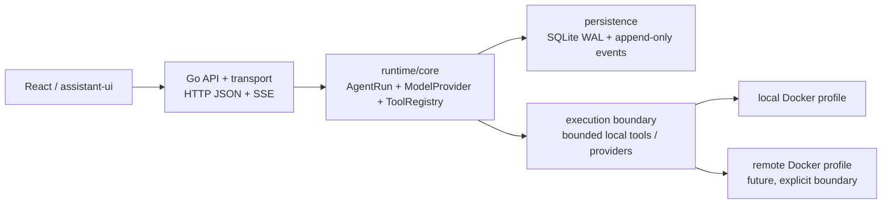

# DeepStudent Go backend foundation

This slice establishes a modular monolith boundary for a local-first runtime. It
keeps the browser transport, agent contracts, persistence, and execution
boundary replaceable without introducing a service mesh or a remote queue.

## Runtime contracts

`internal/runtime` contains provider-neutral contracts. A `ModelProvider` emits
`StreamEvent` values; an `AgentRuntime` starts a run and supports subscriptions;
`ToolRegistry` is a narrow allow-list interface; and `SessionStore` appends
immutable events. `DeterministicProvider` and `DeterministicRuntime` make the
first SSE path deterministic and offline, so the UI can move from a mock stream
to `/api/v1/runs/:id/events` without provider credentials.

## HTTP contract

- `GET /healthz` is a process liveness check
- `GET /readyz` is a dependency/readiness check
- `GET /api/v1/` returns the API version
- `POST /api/v1/runs` starts a deterministic run
- `GET /api/v1/runs/:id/events` streams `text/event-stream`

Every response includes `X-Request-ID`; JSON failures use an envelope with
`error.code`, `error.message`, and `error.request_id`. CORS is an exact-origin
allowlist. Wildcards are intentionally unsupported in the local profile.

## Configuration and secrets

Configuration loads defaults, an optional JSON config file, then environment
overrides. Provider profiles hold `apiKeyEnv` references only. Secret values are
never represented in logs, persisted tables, event payloads, or browser JSON.
The default provider is an offline deterministic stub. Runtime execution applies
the configured default timeout and bounds queued work with context cancellation.
Login is disabled in the first profile; `internal/auth` defines the future
server-side session boundary and requires Argon2id for any password flow.

Model selection is composable: a run can name `provider`, `model`, optional
`reasoning_effort`, positive `max_tokens`, and input capabilities (`text`,
`image`, `audio`, `video`, or `file`). Model profiles override provider
defaults. Endpoint values can come from `baseURL` or a `baseURLEnv` reference;
credentials remain environment variable names only. `config.Manager` validates
and atomically swaps reload snapshots without probing providers.

## Persistence

`internal/storage` opens SQLite with WAL and a single writer (`SetMaxOpenConns(1)`).
The first migration creates `sessions`, `runs`, `session_events`,
`provider_profiles`, `settings`, and `jobs` plus `schema_migrations`. Appending a
session event calculates its sequence and inserts it in one transaction. The
current foundation commits each emitted event synchronously; batching and
separate read pooling require benchmark and replay-semantics work before they
are enabled.

## Profiles and resource limits

The `Dockerfile` builds a CGO-free server image and uses a SQLite volume. The
compose server binds the host port to `127.0.0.1`; it is suitable for a local
profile, while a future remote profile should add an explicit authenticated
execution boundary. Defaults cap model tokens at 2048 and runtime concurrency
at 2. Read and idle timeouts stay finite; the HTTP write timeout is disabled by
default because `net/http` applies it to the full lifetime of SSE responses.
