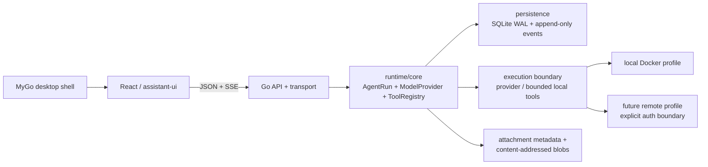

# DeepStudent Go 后端基础架构

本切片建立一个本地优先的模块化单体边界：浏览器传输、agent contract、持久化和执行边界可以替换，但暂不引入 service mesh 或远程队列。Go 服务是会话、消息、run 和事件的服务器权威；React/MyGo 只是客户端壳。

## 运行时 contract

`internal/runtime` 定义与 provider 无关的接口：

- `ModelProvider.Stream` 产生 `StreamEvent`；实现不得在事件或错误中暴露凭据。
- `AgentRuntime.Start/Subscribe` 启动 run 并向订阅者提供事件。
- `ToolRegistry` 是未来工具 allow-list 的窄接口；当前没有生产工具沙箱。
- `SessionStore` 追加不可变 `SessionEvent`；可选 `SessionCatalog` 提供会话、消息查询。
- `RunStore` 保存 run 创建/终止状态；`RunReader` 在内存状态不存在时从 SQLite 读取状态。

`DeterministicProvider` 和 `DeterministicRuntime` 让第一条 SSE 路径完全离线、可重复。runtime 在把事件广播给客户端前尝试追加到持久化 store；文本增量同时形成 assistant message。`ProviderRouter` 只负责 provider 选择，HTTP 层永远不接收密钥值。

默认 `cmd/server` 注册 `deterministic`，并为配置中启用的 SiliconFlow、DeepSeek、custom OpenAI-compatible profile 创建兼容适配器。真实 provider 在请求时从 `apiKeyEnv` 指向的环境变量读取密钥；密钥不进入 SQLite、事件、日志或浏览器 JSON。

## HTTP 与 SSE contract

当前 HTTP 资源：

- `GET /healthz`：进程存活
- `GET /readyz`：runtime 就绪
- `GET /api/v1/`：API 版本
- `GET|POST /api/v1/sessions`：会话列表/创建
- `GET /api/v1/sessions/:id`：会话详情
- `GET|POST /api/v1/sessions/:id/messages`：消息读取/追加 prompt 并启动 run
- `POST /api/v1/runs`：启动 run
- `GET /api/v1/runs/:id`：读取 run 状态（当前 runtime 优先查进程内状态；run 被清理后还不能可靠回退到 SQLite）
- `POST /api/v1/runs/:id/cancel`：请求取消
- `GET /api/v1/runs/:id/events`：`text/event-stream`

每个响应包含 `X-Request-ID`；错误使用 `error.code`、`error.message`、`error.request_id`。CORS 是精确 Origin allowlist。SSE event ID 在内存保留期内稳定；客户端可携带 `Last-Event-ID` 请求后续事件。SSE 默认每 15 秒发送注释 heartbeat；run 无论成功、失败还是取消都会发送终止事件。带 `client_message_id`/`message_id` 的消息重试按 ID 幂等，内容冲突返回 409。

一次 run 的顺序是：提交 JSON → API 持久化用户消息和 run 元数据 → runtime 产生 `run.started`/delta/终止事件 → 事件先写 `session_events` 再广播 → assistant delta 写入 `messages` → 终止状态写入 `runs`。当前重放只读取进程内历史（结束后约 5 分钟）；`session_events` 还没有对应的 HTTP durable replay 查询，所以不能声称支持跨进程恢复。

## 配置、模型与密钥

配置加载顺序为内置默认值、可选 JSON、环境变量覆盖。`config.Manager.Reload` 只原子替换已校验快照；无效编辑保留 last-known-good，不探测 provider 或凭据是否可用。

一次 run 可指定 `provider`、`model`、`reasoning_effort`、正数 `max_tokens` 和输入能力（`text`、`image`、`audio`、`video`、`file`）。模型 profile 可覆盖 provider 默认值；`baseURL`/`baseURLEnv` 决定 endpoint，`apiKeyEnv` 只保存环境变量名。runtime 的全局 token 上限是最后一道上限。

默认值包括：监听 `127.0.0.1:8080`，SQLite `data/deepstudent.db`，blob 根 `data/blobs`，默认 provider `deterministic`，默认超时 45 秒，最大 token 2048，最大并发 2，附件上限 32 MiB。默认 HTTP read/idle timeout 分别为 15 秒/60 秒，write timeout 为 0；若为长 SSE 流配置非零 write timeout，需确认其生命周期足够。

## 持久化

`internal/storage` 启用 SQLite WAL、外键约束，并通过 `SetMaxOpenConns(1)` 强制单写入者。迁移当前为 3 个版本：

1. `sessions`、`runs`、`session_events`、`provider_profiles`、`settings`、`jobs`
2. 会话 `title`、`messages` 表，以及会话/事件/run 查询索引
3. `attachments` 元数据表及创建时间索引

`session_events` 以 `(session_id, sequence)` 维护顺序；每次追加在短事务中更新会话时间并插入一条事件。附件字节永远不进 SQLite，由 `internal/attachments` 流式计算 SHA-256 并写到内容寻址 blob tree；`AttachmentStore` 只允许通过已登记的 `workspace://attachments/<sha256>` 引用打开文件。SQLite 与 blob 根必须作为同一个备份边界。v1 HTTP API 暴露 `POST /api/v1/attachments` multipart 上传，以及 `GET /api/v1/attachments/:id` 内容流/元数据查询（`?metadata=1`、`/metadata`、`/content`、`/download` 为兼容别名）。路径只接受 SHA-256 或严格校验的 `workspace://` 引用，不会将客户端路径直接拼接到 blob 根目录。

本基础架构目前同步提交每个事件，但事件持久化错误不会形成完整的客户端错误语义；批量写入、blob GC、独立读池、崩溃恢复和 durable replay 需要先完成基准测试与契约设计。

## Profile 与资源限制

`Dockerfile` 构建 CGO-free server image，并将 `/data` 作为 SQLite/附件 volume；Compose 将宿主机端口限制为 `127.0.0.1`，适合本地 profile。未来 remote profile 必须单独增加认证、权限和工具执行边界。Distroless 镜像以 non-root UID 65532 运行，镜像预创建 `/data` 以保证新 named volume 可写；切换 volume driver 或 bind mount 时必须重新检查权限。

认证在第一版默认关闭。`internal/auth` 仅定义未来服务端 session boundary 的接口，密码流程需要 Argon2id 和可撤销的 opaque session cookie。不要把 provider API key、密码或 token 放入请求体、前端代码、配置文件、事件或日志。

## 前后端拆分与迁移顺序

`frontend/` 的 React 壳可独立通过 Vite 运行，也可被 MyGo 窗口托管；`frontend/src/mygo.ts` 保留生成兼容的类型化健康桥接。当前聊天、附件上传和学习资源导入已通过类型化 HTTP/SSE adapter 接入 Go runtime；runtime 不可用时才使用本地 fallback。迁移时建议按以下顺序推进：

1. 补齐事件顺序、断线、取消和持久 replay 的 contract tests。
2. 再启用真实 provider、认证和远程部署；附件 HTTP API 已有本地 v1 contract，但远程暴露仍需鉴权和配额 gate。
3. 加入 RAG、工具沙箱、监控、备份/恢复、签名发布和事故 runbook gate。

在这些 gate 通过前，本目录只能作为本机/测试实验，不应被描述为生产就绪。
